# Hybrid Cloud Observability Network Monitoring
## Exam Content Outline
1. Network Monitoring (Questions related to these tasks make up 60% of the exam.)
   - SolarWinds MIB Database
   - Customize SNMP Pollers, UnDP, and Device Studio
   - Network Monitoring Capacity Planning
   - Network Insight™
   - NetPath™
   - Troubleshooting Issues with Nodes, Interfaces, and SNMP Polling
2. Flow Monitoring (Questions related to these tasks make up 30% of the exam.)
   - Fundamentals of IP Flow Monitoring
   - IP Flow Monitoring Architecture and Best Practices
   - Manage Flow Views and Widgets
   - IP Address Groups and Application Port Mapping
   - Optimizing Flow Management
   - Flow Navigator and Flow Alerts
   - Troubleshooting Hybrid Cloud Observability IP Flow Monitoring
3. Log Analysis and Monitoring (Questions related to these tasks make up 10% of the exam.)
   - Log Collection Requirements and Configuration
   - Event and Log Collection
   - Rules and Processing Policies

## 1. Network Monitoring (Questions related to these tasks make up 60% of the exam.)
### 1.1. SolarWinds MIB Database
#### [What is a MIB, OID, and how they are used in Orion](https://support.solarwinds.com/SuccessCenter/s/article/What-is-a-MIB-OID-and-how-they-are-used)

##### What are MIBs and OIDs?
Management Information Base (MIB) is a structure that describes all objects a device can report on, such as CPU, fan, or temperature. MIB contains the name, datatype, and the object identifier (OID). MIB is a hierarchical structure, displayed as a navigation tree. Every entry in the MIB tree is a value for a specific component on a specific device.

Each entry in the tree is followed by a number in parenthesis. Each entry in the tree can be specified using the sequence of numbers, such as `1.3.6.1` (`iso.org.dod.internet`). The unique numerical value is the OID.

##### What is SolarWinds Orion MIB?
SolarWinds maintains a MIB database that serves as a repository for the OIDs used to monitor a wide variety of network devices. The MIB database is compiled once a week. You are notified when the new MIB database is available.

##### What are MIBs used for? 
- To support the Orion SNMP Trap Server. The SNMP trap server "listens" on a specified port, and when a trap is sent on the port, it processes the message. The trap server looks up the trap in the MIB database to determine how to handle it. Furthermore, creating an SNMP Trap Rule to take some action based on the specific trap can also involve a lookup in the MIB database.
  - [Configure Trap Viewer filters and alerts (deprecated)](https://www.solarwinds.com/documentation/en/flarehelp/orionplatform/content/core-configuring-trap-viewer-filters-and-alerts-sw272.htm)
- To create [Universal Device Pollers](https://documentation.solarwinds.com/en/success_center/npm/content/core-creating-universal-device-pollers-sw551.htm). Based on individual OIDs in the MIB tree, you can customize what data you want to poll for your devices.
- To create customized [Device Pollers](https://documentation.solarwinds.com/en/success_center/npm/content/core-creating-device-studio-pollers-sw2534.htm). You need to know OIDs that provide the data you need to poll from your devices.
See [Create custom monitors](https://documentation.solarwinds.com/en/success_center/npm/content/npm-custom-monitoring.htm) to decide whether to crate a Universal Device Poller or a custom device poller.

##### What are MIBs NOT used for? 
MIBs are not used to identify devices. When a new device is added to NPM, Orion does an SNMP query, pulls back an OID called the sysobjectID. Orion compares this value with the sysobjectID database to identify the vendor, machine type, and so on.

The sysobjectID database is completely different from the MIB database. Therefore, when you add a device that Orion does not recognize, updating the MIB database won’t help. You would have to update the sysobjectID database and that only happens with releases and service packs. It is not part of the weekly MIB database update.

Having two databases is a result of product evolution. The sysobjectID database came first, long before Orion had a trap server or a Universal Device Poller. SNMP traps were added in 8.0, the Universal Device Poller was added in 9.0, and both of these features needed a robust MIB database. The older sysobjectID store was not appropriate, and thus Orion inherited the existing MIB database from SolarWinds Engineer’s Toolset.

##### What if I do not know what OIDs I need to poll? 
If you do not know the exact OID, but have a general gist, such as "I want to measure something like temperature on a Cisco router", you can search for the OID in the MIB tree.

You can [Browse the MIB tree in the UnDP application](https://documentation.solarwinds.com/en/success_center/npm/content/core-creating-universal-device-pollers-sw551.htm) or in the OID picker within the Create Poller Package wizard. Browse the MIB tree or enter a keyword (or even the OID number) into the search box.

You can also consult your vendor documentation to find out the OIDS to monitor on your devices.

##### What if OIDs are not in my MIB? 
When you are creating a UnDP poller and cannot find an OID in the MIB tree, [Update the MIB database](https://documentation.solarwinds.com/en/success_center/npm/content/core-management-information-base--mib--sw1730.htm).

OIDs you want to poll using a device studio poller do not have to be in the SolarWinds MIB database. If an OID is assigned to a device, NPM tries to poll it, regardless of whether it is in the MIB database or not.

If the OID is not in the MIB database, launch the Create Poller Package wizard, select the Manually Define Object Identifier box, and enter the OID details yourself. See [Create Pollers in Device Studio](https://documentation.solarwinds.com/en/success_center/npm/content/core-creating-device-studio-pollers-sw2534.htm) and [Define object identifiers manually](https://documentation.solarwinds.com/en/success_center/npm/content/core-manually-defining-object-identifiers--oids--sw2546.htm).

##### How does adding MIBs to Orion affect my Orion Platform installation? 
- Adding MIBs to Orion does not change the way Orion polls devices.
- If you list the resource of the device and is not seeing certain resource (CPU, Memory, Interfaces, hardware health, etc), adding the MIB will not resolve the issue. The resource will still not be shown even after MIB compilation.
- Adding MIBs to Orion does not change a device that has an Unknown machine type.
- Adding MIBs to Orion allows Orion to display trap messages from the device.
- Adding MIBs to Orion allows you to search for OIDs in the Universal Device Poller.
- If you know the OID, you can create a UnDP poller for the device without the OID being in the MIB database. See [Monitoring MIBs with Universal Device Pollers](https://documentation.solarwinds.com/en/success_center/npm/content/core-monitoring-mibs-with-universal-device-pollers-sw548.htm).

##### Additional Resources
- [Trap templates](https://documentation.solarwinds.com/en/success_center/orionplatform/content/core-what-is-a-trap-template.htm) are used to format your trap messages. You can use SolarWinds macros or variables in the OID Value and ValueName attributes or call values from your MIB.
- [Trigger alerts when receiving specific Syslog messages (deprecated)](https://www.solarwinds.com/documentation/en/flarehelp/orionplatform/content/core-configuring-syslog-viewer-filters-and-alerts-sw1250.htm)
- [Syslog alert actions (deprecated)](https://www.solarwinds.com/documentation/en/flarehelp/orionplatform/content/core-available-syslog-alert-actions-sw1172.htm)

### 1.2. Customize SNMP Pollers, UnDP, and Device Studio
#### [Orion SNMP Get Type statements](https://support.solarwinds.com/SuccessCenter/s/article/Orion-SNMP-Get-statements)

SNMP Get Type defines the SNMP polling method used by your Universal Device Poller to get the devices' OID values. The polling method is determined primarily by the type of object that you want to poll. MIB values require either GET or GET NEXT, and MIB tables require GET TABLE. The SNMP get types available for Universal Device Pollers are described in the following:
- **GET** - SNMP GET is used with an OID to retrieve the value of the object with the given OID.
   - For example, `SNMP GET 1.3.6.1.2.1.11.1.0` retrieves the value of `RFC1213-MIB:snmpInPkts` (`OID 1.3.6.1.2.1.11.1`) for instance 0 of the polled device.
- **GET NEXT** - SNMP GET NEXT is used with an OID to retrieve the value of the object with the OID immediately following the given OID.
   - For example, `SNMP GET NEXT 1.3.6.1.2.1.11.1.0` retrieves the value of `RFC1213-MIB:snmpOutPkts` (`OID 1.3.6.1.2.1.11.2`) for instance 0 of the polled device.
- **GET TABLE** - SNMP GET TABLE is used with a MIB table OID to retrieve the table with the specified OID.
   - For example, `SNMP GET TABLE 1.3.6.1.2.1.4.22.0` retrieves the table of values `RFC1213-MIB:ipNetToMediaTable` (`OID 1.3.6.1.2.1.4.22`) for instance 0 of the polled device.

#### [Device Studio technologies in NPM](https://documentation.solarwinds.com/en/success_center/npm/content/core-device-studio-technologies.htm)
Device Studio supports a number of technologies. Each technology has a defined set of properties that you can monitor on your devices. The technology you select defines how the polled data are processed, stored, and presented.

|technology|usage|
|------|------|
|CPU & Memory|CPU & Memory is used for collecting data about the CPU and memory load of single processor systems. It provides data to resources related to CPU and memory, such as Average CPU Load & Memory Utilization, Min/Max/Average of Average CPU Load, or Top CPUs by Percent Load. To use this technology, specify a single OID that reports a value from 0 to 100. For example, if a natively polled OID returns incorrect CPU load values, search for an OID that returns a possible value. In the case of CPU load, the load can vary between 0% and 100%, so you must look for an OID that returns a value between 0 and 100.|
|Multi CPU & Memory|Multi CPU & Memory provides data to the same resources for multiprocessor systems as the CPU & Memory technology provides for single processor systems. For example, if a natively polled OID returns incorrect CPU load values, search for an OID that returns possible values. In the case of CPU load, the load can vary between 0% and 100% on each CPU core, so you must look for an OID that returns a table of values between 0 and 100, where each row corresponds to a CPU core.|
|Node Details|Node Details provides data for the Node Details resource, and can be used for devices that are not supported out of the box. To use this technology, specify custom OIDs to poll for Vendor, Machine Type, Software Version, and other data. You can also define custom text to be used instead of the polled value.|

##### Data sources used in Device Studio
By creating Device Studio pollers, you can define custom polling definitions in a way that allows you to view the defined set of pollers and the data polled by them as fully integrated entities in the SolarWinds Platform Web Console, including charts, alerts, and reports. You can define a set of polled data, and then associate these data points with monitored nodes. The data source you use for polling devices can be:
- A polled value or values reported by a device on an OID.
- A calculated value that results from the transformation of polled values.
- A fixed value in the form of a constant number or text. This value is not polled. For example, you can specify the software version of your device as 15.

#### [How to Create a Universal Device Poller (UnDP) in NPM](https://support.solarwinds.com/SuccessCenter/s/article/Create-a-Universal-Device-Poller-UnDP)

Create a Universal Device Poller (UnDP) to define a custom statistic to monitor.

**Note:** _UnDP is only applicable to SNMP polled nodes as it uses OID to gather the necessary information._

**Note:** _You can only create one UNDP at a time._

You can see a walk-thru by our Head Geeks in the Lab Bits video:
- [SolarWinds Lab Bits: Setting up Universal Device Pollers (UnDPs)](https://www.youtube.com/watch?v=h5RgUvtz7Xg)

Before you begin, consult your vendor documentation, and find out which OID you want to monitor.
- [Define a custom statistic to monitor in the NPM](https://documentation.solarwinds.com/en/success_center/npm/content/core-creating-universal-device-pollers-sw551.htm)
- [Select NPM nodes or interfaces to poll a custom statistic](https://documentation.solarwinds.com/en/success_center/npm/content/core-assigning-pollers-to-nodes-or-interfaces-sw146.htm)

#### [Update the SolarWinds MIB Database for the SolarWinds Platform](https://documentation.solarwinds.com/en/success_center/npm/content/core-downloading-the-solarwinds-mib-database-sw3581.htm)

SolarWinds maintains a MIB database that serves as a repository for the OIDs used to monitor a wide variety of network devices. The MIB database is updated regularly. **When you are creating a UnDP poller and cannot find an OID in the MIB tree, update the MIB database.**
- [Download MIB database from the SolarWinds Platform Web Console (Orion Platform 2020.2 and later)](https://documentation.solarwinds.com/en/success_center/npm/content/core-downloading-the-solarwinds-mib-database-sw3581.htm#Download)
- [Download MIB database from the Customer Portal (offline environments)](https://documentation.solarwinds.com/en/success_center/npm/content/core-downloading-the-solarwinds-mib-database-sw3581.htm#Download2)
- [Learn more about MIBs](https://documentation.solarwinds.com/en/success_center/npm/content/core-downloading-the-solarwinds-mib-database-sw3581.htm#Learn)

##### Download the MIB Database from the SolarWinds Platform Web Console
You can check the status of your MIBs database and download the latest MIBs database directly from the SolarWinds Platform Web Console.
1. Log in to your SolarWinds Platform Web Console.
2. Click Settings > All Settings > MIBs Management in the Details section. The page informs you about the MIBs database installed on your main polling engine and about the latest available version.
3. If an updated version of the MIBs database is available, click Download. This downloads the latest version of the MIBs database as a MIBs.msi file.
> [!TIP]
> Keep the Show notifications setting enabled to be informed about an updated MIBs database version on relevant places - in the MIB Browser, in the Device Studio, and in the Universal Device Poller tool. The message includes a link to MIBs Management so that you can quickly download and update the MIBs database.

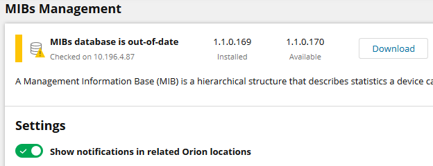

4. After the download completes, run MIBs.msi installer and complete the installation wizard. The Installer informs you when Orion services need to be restarted and restarts them if necessary.
5. Run the .msi file on all deployed polling engines - on the main polling server, HA backup server, and any additional polling engines.

##### Download the MIB database from the Customer Portal
When your SolarWinds Platform is not connected to the Internet, download the MIB database from the Customer Portal.

###### Download the MIB database
1. Log in to the Customer Portal `https://customerportal.solarwinds.com/` using your SolarWinds Customer ID and Password.
2. In the navigation bar, click Downloads > Orion MIB Database.
3. On the MIB Database page, click Download As MSI.
4. If you are using Internet Explorer and it prompts you to add the SolarWinds downloads site `http://solarwinds.s3.amazonaws.com`, add the site to your trusted sites.
5. Install the MIB database. Follow instructions for [2020.2 and later](https://documentation.solarwinds.com/en/success_center/npm/content/core-downloading-the-solarwinds-mib-database-sw3581.htm#Install2020-2) (offline environment).

###### Install the MIB database in an offline environment
1. If your SolarWinds Platform is in an offline environment, download the MSI version of the MIBs database and transfer the file to your scalability engines.
2. Run the MSI on all deployed polling engines - on the main polling engine server, HA backup server, and any additional polling engines.

When finished, you can check the MIBs database version in the MIBs Management view of the SolarWinds Platform Web Console.

###### Learn more about MIBs
What is a MIB?
- See [What is a MIB, OID, and how they are used.](https://www.solarwinds.com/documentation/kbloader.aspx?kb=5506)

Check an OID in the SolarWinds MIBs database
1. Go to the Details view for a device.
2. In the Management widget, click the MIB Browser button. The online MIB Browser opens. You can navigate through the SolarWinds MIB database and check whether an OID is available.

Add a device MIB
- If you have a specific device MIB, you can have it added to the SolarWinds MIB database. See [Add MIBs to the SolarWinds MIB database](https://support.solarwinds.com/SuccessCenter/s/article/Add-MIBs-to-the-SolarWinds-MIB-database).

#### [Management Information Base (MIB) in the SolarWinds Platform](https://documentation.solarwinds.com/en/success_center/orionplatform/content/core-management-information-base--mib--sw1730.htm)
Management Information Base (MIB) is a structure that describes all objects a device can report on, such as CPU, fan, or temperature. MIB contains the name, datatype, and the object identifier (OID). MIB is a hierarchical structure, displayed as a navigation tree. Every entry in the MIB tree is a value for a specific component on a specific device.

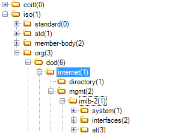

Each entry in the tree is followed by a number in parenthesis. Each entry in the tree can be specified using the sequence of numbers, such as `1.3.6.1` (`iso.org.dod.internet`). The unique numerical value is the OID.

For more information, see [Management Information Base (MIB) for the Simple Network Management Protocol (SNMP)](https://tools.ietf.org/html/rfc3418).
##### MIBs in the SolarWinds Platform
SolarWinds maintains a MIB database that serves as a repository for the OIDs used to monitor a wide variety of network devices. The MIB database is updated regularly.

##### Where to find information about the SolarWinds MIBs database?
Administrators can find out the currently used version in the SolarWinds Platform Web Console.
1. Click Settings > All Settings and scroll down to the Details section.
2. Click MIBs Management and check the details. If a new version is available, [download and install it](https://documentation.solarwinds.com/en/success_center/orionplatform/content/core-downloading-the-solarwinds-mib-database-sw3581.htm).

##### How do I check whether an OID is included in the database and polled on a device?
Use the MIB Browser.
- In the SolarWinds Platform Web Console, go to the Details view for the device, find the Management widget, and click MIB Browser.
- Navigate the tree. Click an OID to display more details about in the Selected OID pane.

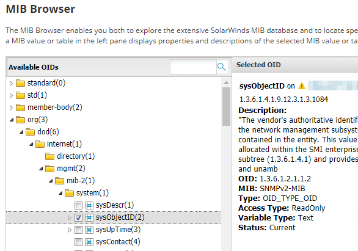

You can also access the MIB Browser from Device Studio and from Universal Device Poller.

#### [Create pollers in Device Studio for NPM](https://documentation.solarwinds.com/en/success_center/npm/content/core-creating-device-studio-pollers-sw2534.htm)
To poll unique devices or technologies not supported by default, create a custom poller.
> [!TIP]
> Reduce the number of Unknown nodes by creating a custom poller.
1. Click Settings > All Settings, and in the Node & Group management grouping, click Manage Pollers.
2. Click Create New Poller.

   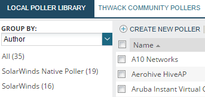

3. Select a polling technology, type the Poller Package Name, select a test node, and click Next.
   > [!NOTE]
   > When you are creating the poller, the test node is polled to provide a preview of the results returned by the poller.
   
   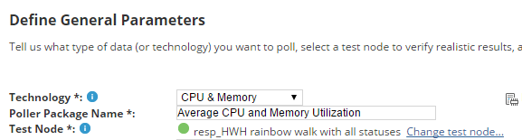

4. On the Specify Data Source tab, select a metric you want to define, and click Define Data Source.

   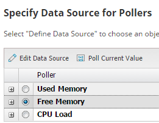

5. On the Pick Object Identifier screen, type the OID, or search the MIB database. For information about manually defining OIDs, see [Define object identifiers (OIDs) that do not exist in the SolarWinds MIB database for NPM](https://documentation.solarwinds.com/en/success_center/npm/content/core-manually-defining-object-identifiers--oids--sw2546.htm).

   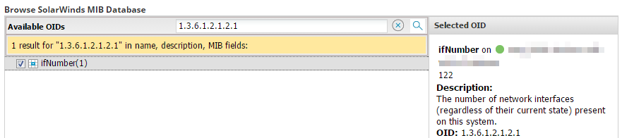

6. If necessary, click Add Calculated Value to transform the multiple returned values into a single value, or select a different OID.
   > [!TIP]
   > Transforming multiple values to a single value is useful if, for example, the device returns CPU usage as a table of four values (with one value for each CPU core), but you want to use a single value for CPU usage. In this case, you can use the Average function to convert the table of values into a single value.
   
   For more information, see [What is a formula in NPM?](https://documentation.solarwinds.com/en/success_center/npm/content/core-what-is-a-formula--sw2552.htm)
7. In the Create a Calculated Value screen, select a function, select an input from the lists, and click Test. You can also define a constant value, for example, if you are creating a CPU and memory poller, and the device you want to poll only supports CPU values.
   > [!TIP]
   > Continuing with the previous example, to create an average value out of the four reported values, select the Average function and specify the input values.

   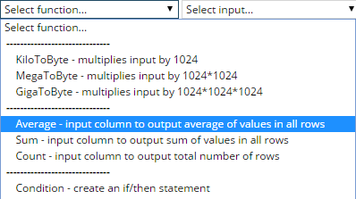

   For more information, see [Formulas used for transforming Device Studio poller results in NPM](https://documentation.solarwinds.com/en/success_center/npm/content/core-common-formulas-sw2531.htm).
8. After testing whether the value is as expected, click Yes, the Data Source Is Reasonable.
9. To automatically test the poller on newly added nodes, select Automatically poll nodes during network discovery, and click Next. The test determines whether the Device Studio poller can be assigned to the newly added node.

   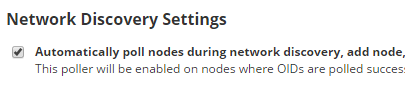

10. On the Summary tab, review the poller package settings, and click Submit.

The poller is now available in the list of pollers, and you can assign it to nodes. See [Assign Device Studio pollers to monitored devices in NPM](https://documentation.solarwinds.com/en/success_center/npm/content/core-assigning-pollers-sw2525.htm).

#### [Monitor custom statistics based on OIDs with Universal Device Pollers in the NPM](https://documentation.solarwinds.com/en/success_center/npm/content/core-monitoring-mibs-with-universal-device-pollers-sw548.htm)

SolarWinds Universal Device Poller (UnDP) is a customization feature of NPM. With UnDP, you can create custom monitors for almost any statistic provided by SNMP based on its Management Information Base (MIB) and object identifier (OID). See [Management Information Base (MIB) in the NPM](https://documentation.solarwinds.com/en/success_center/npm/content/core-management-information-base--mib--sw1730.htm).
With Universal Device Poller, you can monitor:
- Interface traffic
- CPU temperature
- Addressing errors
- UPS battery status
- Current connections to a website

##### Before you start configuring UnDPs
- Consult your vendor documentation, and find out which OID you want to monitor. 
- Create a list of nodes that you want to poll the custom statistic on.
> [!TIP]
> UnDPs do not collect data from Orion Failover Engine or Hot Standby Engines. If a NPM server fails, data collection for any Universal Device Pollers stops on the server.
> 
> UnDPs are tied to the polling engine on which they are hosted. If you move a monitored node from one polling engine to another, you must also move the UnDP poller.

##### Configure custom pollers for monitoring (Admin)
- [Define a custom statistic to monitor in the NPM](https://documentation.solarwinds.com/en/success_center/npm/content/core-creating-universal-device-pollers-sw551.htm)
- [Select NPM nodes or interfaces to poll a custom statistic](https://documentation.solarwinds.com/en/success_center/npm/content/core-assigning-pollers-to-nodes-or-interfaces-sw146.htm)
- [Transform poller results in the SolarWinds Platform](https://documentation.solarwinds.com/en/success_center/npm/content/core-transforming-poller-results-sw704.htm)
- [View UnDP status on Network Atlas maps in NPM](https://documentation.solarwinds.com/en/success_center/npm/content/core-mapping-universal-device-pollers-with-network-atlas-sw539.htm)
- [View Universal Device Poller statistics in NPM](https://documentation.solarwinds.com/en/success_center/npm/content/core-viewing-universal-device-poller-statistics-sw755.htm)
- [Create pollers by duplicating and adjusting pollers in NPM](https://documentation.solarwinds.com/en/success_center/npm/content/core-duplicating-an-existing-poller-sw344.htm)
- [Export UnDP pollers from NPM](https://documentation.solarwinds.com/en/success_center/npm/content/core-exporting-universal-device-pollers-sw503.htm)
- [Define UnDP Warning and Critical thresholds in NPM](https://documentation.solarwinds.com/en/success_center/npm/content/core-configuring-universal-device-poller-thresholds-sw3662.htm)
- [Temporarily suspend collecting statistics for pollers in NPM](https://documentation.solarwinds.com/en/success_center/npm/content/core-disabling-assigned-pollers-sw326.htm)
##### Troubleshooting
- [Update the SolarWinds MIB Database for the SolarWinds Platform](https://documentation.solarwinds.com/en/success_center/npm/content/core-downloading-the-solarwinds-mib-database-sw3581.htm)

#### [Define object identifiers (OIDs) that do not exist in the SolarWinds MIB database for the SolarWinds Platform](https://www.solarwinds.com/documentation/en/flarehelp/orionplatform/content/core-manually-defining-object-identifiers--oids--sw2546.htm)
1. On the Pick Object Identifier screen, select the check box under Manually Define Object Identifier (OID).
   > [!NOTE]
   > Not sure how to get here? See [Create Pollers](https://www.solarwinds.com/documentation/en/flarehelp/orionplatform/content/core-creating-device-studio-pollers-sw2534.htm) for more details.
2. Type the name and OID.
3. Select the SNMP get type. See [What is the SNMP Get Type?](https://www.solarwinds.com/documentation/en/flarehelp/orionplatform/content/core-snmp-get-type-sw2549.htm) for more information.
4. Click Poll Current Value From Test Node.

#### [This OID is not supported UnDP error in NPM](https://support.solarwinds.com/SuccessCenter/s/article/UNDP-error-This-OID-is-not-supported)
This OID is not supported can be seen for UNDP not configured correctly or the OIDs does not appear to be present on the MIB of the devices

##### OVERVIEW
The following errors appears when creating a new universal device poller (UNDP) with an unknown OID:
`This OID is not supported`

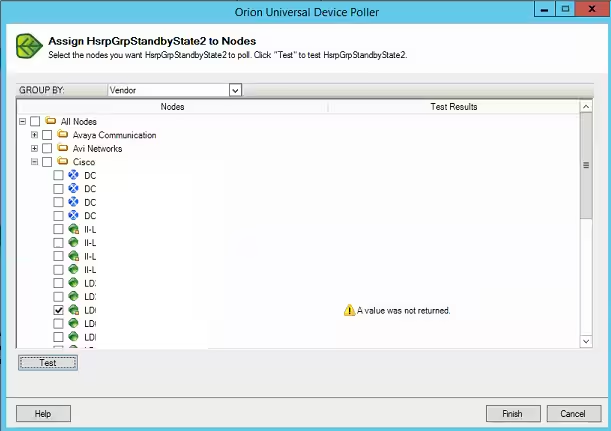

`Unable to poll this OID on the test node. Try using a different OID or a different test Node.`

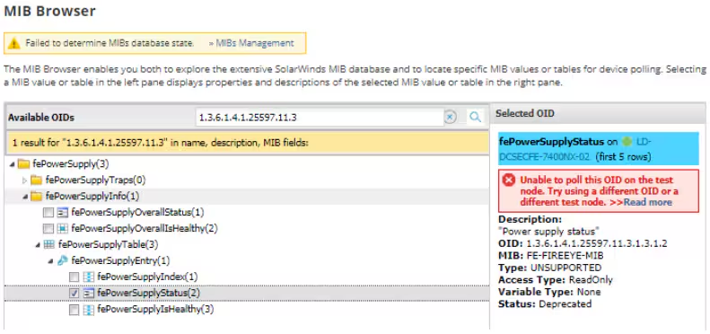

##### CAUSE
There are three types of OIDs:
1. GET
2. GET NEXT
3. GET TABLE 

The error occurs when the incorrect OID type is selected. 

##### RESOLUTION
###### Solution 1:
1. Collect Run SolarWinds SNMP Walk and verify the corresponding OID.
2. Most likely this OID does not exist in the node. 
3. You should refer to the device owner or vendor and get correct OID.

###### Solution 2:
1. Once you have confirmed OID is correct, on the UNDP you have set up, click Show Advanced Options.
2. Select the appropriate option. (e.g, Change the type to GET )
3. Retest the Poller against the node.

#### [Assign an Existing Custom Poller (UnDP) to a New Node](https://support.solarwinds.com/SuccessCenter/s/article/Assign-an-Existing-Custom-Poller-UnDP-to-a-New-Node)
This article covers when assigning a node to a specific UnDP.

##### OVERVIEW
This article provides the steps on how to assign an Existing Custom Poller (UnDP) to a new node.

##### RESOLUTION
###### Add a Node
1. Open Orion Web Console and navigate to:
   - Settings > Manage Nodes
2. Click on Add Node
3. On Choose Resource select all that apply
4. Do not change anything under Add Pollers
5. Do not change anything under Change Properties
6. Click on Add Node
###### Assign a Node
1. Open Orion **Universal Device Poller** (Default location: C:\Program Files (x86)\SolarWinds\Orion\NPM\UniversalDevicePoller.exe)
   - Start > All Programs > SolarWinds Orion > Universal Device Poller
   - Search > Orion Universal Device Poller
2. Under All Defined Pollers, right-click on the existing Defined Poller and click on Assign
3. Click + to expand the All Nodes and locate the newly created node
4. Select the newly created node and click on Test
5. Once the test is successful, click on Finish to complete the process

#### [Test Device Studio pollers in NPM](https://documentation.solarwinds.com/en/success_center/npm/content/core-testing-device-studio-pollers.htm)
A Device Studio poller may not always be seamlessly supported by the device it is tested on. For example, errors occur if the OID the Device Studio poller polls for is not supported by the device, or if the returned value is not of the expected data type defined by the Device Studio poller.

To get the Device Studio poller working in your environment, try the following:
- Test the Device Studio poller on a different node.
- If the device you use for testing is not fully compatible with the Device Studio poller, upgrading the firmware of your test device might help.
- Modify the Device Studio poller to suit the devices you have. For example, you can modify the OID that is used to poll the device.
   > [!NOTE]
   > - Modifying Device Studio pollers this way requires familiarity with the MIB database structure.
   > - Some of the pollers provided by SolarWinds cannot be modified with Device Studio. You can only modify the poller definition of these pollers in a text editor.

#### [View Universal Device Poller statistics in NPM](https://documentation.solarwinds.com/en/success_center/npm/content/core-viewing-universal-device-poller-statistics-sw755.htm)
If you want to see a poller results in the SolarWinds Platform Web Console, you need to define which widgets, or resources, should be displayed on which views.

#### [What is the SNMP Get Type?](https://www.solarwinds.com/documentation/en/flarehelp/orionplatform/orionplatform_2022-4/content/core-snmp-get-type-sw2549.htm)

For table records, only the first five values are returned.

#### [Transform poller results in the SolarWinds Platform](https://documentation.solarwinds.com/en/success_center/orionplatform/content/core-transforming-poller-results-sw704.htm)

#### [Create custom monitors in the SolarWinds Platform](https://documentation.solarwinds.com/en/success_center/orionplatform/content/core-custom-monitoring.htm)

### 1.3. Network Monitoring Capacity Planning
#### [Monitor capacity usage trends on the network and forecast capacity issues in NPM](https://documentation.solarwinds.com/en/success_center/npm/content/npm-capacity-forecasting-sw1526.htm)

#### [Customize capacity forecasting settings for single nodes, interfaces, or volumes in NPM](https://documentation.solarwinds.com/en/success_center/npm/content/npm-customizing-thresholds-and-trend-calculation-methods-for-individual-nodes-sw1536.htm)

#### [Change capacity forecasting settings globally in NPM](https://documentation.solarwinds.com/en/success_center/npm/content/npm-changing-capacity-forecasting-settings-globally-sw1533.htm)

#### [Forecast capacity for nodes, interfaces, or volumes in NPM](https://documentation.solarwinds.com/en/success_center/npm/content/npm-forecasting-capacity-for-nodes-or-interfaces-sw1530.htm)

### 1.4. Network Insight™
#### [Set up monitoring Cisco ASA firewalls in NPM](https://documentation.solarwinds.com/en/success_center/npm/content/npm-set-up-firewalls.htm)
Data for monitoring Cisco® ASA firewalls is polled by a combination of SNMP and CLI polling. To get accurate ASA-specific information, add the firewall device to NPM as a node, and provide CLI credentials.
##### What does CLI polling provide?
Enable CLI polling to receive additional ASA-specific details, and to display accurate information for your Cisco ASA devices.
> [!WARNING]
> For example, when polling Site-to-Site VPN tunnels, CLI polling helps filter data polled through SNMP, and display only relevant results. Without CLI polling, you might see failed access attempts from outside as failed tunnels.
###### Information polled by CLI
- Security level and standby IP address for interfaces
- Number of failed connections per minute on the ASA
- High availability details:
  - Configuration sync state
  - Connection sync state
  - Standby state
  - High availability mode
  - Last failover date and time
  - System HA type and system HA role
  - Peer interfaces
- Firewall mode, serial number, and contexts on the ASA device
- All configured Site-to-Site tunnels on the ASA, including inactive tunnels
- For Site-to-Site tunnels, local IP address, local host name, remote IP address, and remote host name
##### Requirements
|Requirement         |Details                                                                                                 |
|--------------------|--------------------------------------------------------------------------------------------------------|
|Cisco ASA version   |Cisco ASA 8.2 and later                                                                                 |
|ASA user account    |Credentials for logging into the ASA device                                                             |
|Enable password     |Credentials for polling CLI details. Without this password, you can access the ASA, but cannot poll it. |
|SSH port            |By default, port 22. Open an SSH port for accessing and polling ASA devices through SSH.                |
##### Add ASA firewalls using CLI credentials
> [!NOTE]
> You need Node Management Rights. See Define what users can access and do.

1. Click Settings > Manage Nodes, and then click Add Node.
2. Enter the IP address for the device.
3. Select Most Devices: SNMP and ICMP as the polling method, and enter SNMP credentials.
4. Choose resources and add pollers if necessary. You can keep the default settings.
5. On the Change Properties screen, enable CLI monitoring:
   - Scroll down to CLI Polling Settings.
   - elect Enable CLI Polling, [enter the credentials](https://support.solarwinds.com/SuccessCenter/s/article/What-privileges-does-an-account-need-to-monitor-Cisco-ASA-or-Cisco-Nexus-devices), and click Test.
6. To use a specific device template, select it. Device templates are sets of commands you can execute on a device. See NCM Getting Started Guide for more information.
7. Complete the Add Node wizard.

You can now view the polled ASA firewall information in NPM.
##### Enable CLI polling on monitored devices
To poll firewall-specific data on ASA devices already monitored in NPM, enable CLI polling for ASAs.

1. On the node details view, click Edit Node in the Management widget.
2. Scroll down to the CLI Polling Settings section.
3. Select Enable CLI Polling, [enter the credentials](https://support.solarwinds.com/SuccessCenter/s/article/What-privileges-does-an-account-need-to-monitor-Cisco-ASA-or-Cisco-Nexus-devices), and click Test.
4. Click Submit.

You can now poll firewall-specific information, such as platform, interface and tunnel details. Pollers for ASA Network Insight are enabled.
##### Troubleshoot CLI polling
If CLI polling has issues, verify the following:
- You have enabled CLI polling on the ASA device.
- You are using the correct user credentials to log in to the ASA device.
- You are using the correct password for CLI access.
- You have enabled Cisco ASA NetInsight pollers:
  - On the node details view, click List Resources in the Management resource.
  - Expand Cisco ASA NetInsight, and select to enable the pollers.
- Enable the CLI session trace to extend logging:
   - Click Settings > All Settings > CLI Settings in the Product Specific grouping.
   - Click Enable Session Tracing, and click Submit. Review the session trace files located at: `%ALLUSERSPROFILE%\Application Data\SolarWinds\Logs\Orion\CLI\Session-Trace`
#### [Create an iControl account for F5 monitoring in NPM](https://support.solarwinds.com/SuccessCenter/s/article/Create-an-iControl-account-for-F5-monitoring)
NPM uses iControl to poll health monitors for Network Insight for F5 BIG-IP load balancers. You can use the default F5 Administrator account for this monitoring. If that is not an option, create a new iControl account. The iControl account you are using in NPM must be a local account directly on the F5 device. You cannot use Active Directory or TACACS accounts.

1. Log in to your F5 device and navigate to System > Users > User list > New user.
2. In the Role drop-down, select Administrator.
3. Finish creating the user.

For more information about user rights:
- Read the section "About iControl and RBAC for user accounts" in the [User Guide for the iControl rest interface](https://clouddocs.f5.com/api/icontrol-rest/) (© 2018 F5 Networks, Inc., available at https://clouddocs.f5.com/, obtained on April 15, 2024)
- Search for "iControl permissions" at https://devcentral.f5.com  (© 2013 VMware, Inc., available at http://www.vmware.com/, obtained on April 15, 2024)

#### [NPM 12.3 and NCM 7.8 feature: Network Insight for Cisco Nexus devices](https://support.solarwinds.com/SuccessCenter/s/article/NPM-12-3-and-NCM-7-8-feature-Network-Insight-for-Cisco-Nexus-devices)
Network Insight for Cisco® Nexus provides insight into the health of your Nexus devices and visibility into your virtual Port Channels (vPCs). It also automates the management of your Nexus infrastructure to help ensure service availability.
#### [Network Insight for Palo Alto - monitor Palo Alto firewalls with NPM](https://documentation.solarwinds.com/en/success_center/npm/content/npm-monitor-palo-alto-firewalls.htm)
Network Insight for Palo Alto firewalls automates the monitoring and management of your Palo Alto infrastructure to provide visibility and help ensure service availability.

For Palo Alto firewalls, you'll find the following subviews:
- [Site-to-Site VPNs](https://documentation.solarwinds.com/en/success_center/npm/content/npm-monitor-palo-alto-firewalls.htm#View): Review names of tunnels, status, failure reason message, IN/OUT transferred data, encryption, hashing, virtual system, security zone, and local and peer IP addresses
- [GlobalProtect VPNs](https://documentation.solarwinds.com/en/success_center/npm/content/npm-monitor-palo-alto-firewalls.htm#View2): Review username, public IP, virtual IP, time of the connection, status, and transferred data

If you also have installed NCM 8.0 or NTA 4.6, review the [feature overview](https://documentation.solarwinds.com/en/Success_Center/orionplatform/content/core-2019-2-palo-alto-feature-overview.htm) to find out what additional details about Palo Alto firewalls you can gain.

|Requirement|Detail|
|---------|------------|
|REST API access|You need valid credentials to poll Palo Alto devices through REST API.|
|Log at Session End| To poll Global Protect throughput data, Log Settings in the Action tab for Security Policy Rule must be configured to Log at Session End.|
|Palo Alto account permissions|To access the statistics, you need an account with the administrator role and the following permissions set for the XML API: **Log**, **Operational Requests**|

#### [Set up Network Insight for F5® BIG-IP® load balancers in NPM](https://documentation.solarwinds.com/en/success_center/npm/content/npm-monitor-load-balancers.htm)
To monitor the servers and connections in your load balancing environment, make sure your F5 devices meet the following requirements, add the F5 devices for monitoring, and enable F5 iControl.

|Requirement|Details|
|-----------------|------------------|
|Supported modules|F5 Local Traffic Managers (LTMs), BIG-IP DNS (formerly called Global Traffic Managers or GTMs)|
|SNMP|Used to poll everything except for health monitors. TMOS version 11.2 and later (including 12.0).|
|iControl by F5| Used to poll health monitors and to enable and disable the rotation of pool members. TMOS version 11.6 and later.|

#### [Review access lists on ASA firewalls in NPM and NCM](https://documentation.solarwinds.com/en/success_center/npm/content/npm_firewall_review_acls.htm)
> [!WARNING]
> To monitor access lists and access the ACL subview, you need NCM installed.

See what ACLs are applied to what interfaces and review those ACLs.
1. Log in to the SolarWinds Platform Web Console.
2. On the Summary view, locate and click your ASA firewall node to go to the Node Details view.
3. Click the Access Lists tab.

If you have NCM installed, you can compare the configuration of access lists. Click Compare ACL to go to the NCM widget. For more details, see [Manage ACLs on Cisco ASA and Nexus devices](https://documentation.solarwinds.com/en/Success_Center/NCM/Content/NCM-View_Compare_ASA_ACL_Rules.htm) in NCM documentation.
#### [BROKEN LINK](https://documentation.solarwinds.com/en/success_center/orionplatform/content/core-2019-2-palo-alto-feature-overview.htm)
### 1.5. NetPath™
#### [NetPath requirements for NPM](https://documentation.solarwinds.com/en/success_center/npm/content/npm-netpath-requirements.htm)
##### Probe computer
Probes are the source of network paths, and the paths are discovered by probes. You [create a probe](https://documentation.solarwinds.com/en/success_center/npm/content/npm-create-a-probe.htm) on a source computer, which must meet the following requirements:
|Type|Requirements|
|-----------------|-----------------|
|Operating system (64-bit only)|Windows Server 2019, Windows Server 2016, Windows Server 2012 R2, Windows Server 2012, Windows Server 2008 R2 SP1, Windows 10 Professional and Enterprise, Windows 8.1, Windows 8, Windows 7|
|CPU cores|2 CPU cores for 20 paths. +1 CPU core per 10 additional paths|
|Hard drive space|1 GB|
|RAM|2 GB|
##### Ports and other firewall settings
Open the following ports on your firewall for network connectivity used by NetPath™. Review other firewall settings.
###### Ports
> [!NOTE]
> You may also need to open the following ports:
> - [NPM ports](https://www.solarwinds.com/documentation/kbloader.aspx?kb=MT75310#NPM) for communication between polling engines.
> - [Agent ports](https://www.solarwinds.com/documentation/kbloader.aspx?kb=MT75310#Orion_Agents) when deploying probes on remote machines using agents.

|Port|Protocol|Service or Process|Direction|Source|Destination|Description|
|-----|-----|-----|-----|-----|-----|-----|
|User configured|TCP|SolarWinds Agent or JobEngineWorker|Outgoing|NetPath™ probe|Endpoint service| Any ports of the monitored services that are assigned to the probe. Used by the NetPath™ probe to discover service status.|
|43, 443|TCP|SolarWinds.BusinessLayerHost (Main Polling Engine)|Outgoing|Main polling engine|BGP data providers and announcements, such as: `http://whois.arin.net/ui/`, `https://stat.ripe.net/`|Used by NetPath™ to query BGP information about the discovered IP addresses.|
###### Other firewall settings
|Setting|Protocol|Service or Process|Direction|Source|Destination|Description|
|-------|-------|-------|-------|-------|-------|-------|
|Allow ICMP type 11 (ICMP Time Exceeded)|ICMP|SolarWinds Agent or JobEngineWorker|Incoming|Networking devices along your path|NetPath™ probe|Used by the NetPath™ probe to discover network paths.|
##### Database storage
When calculating the size requirements in SQL Server for NetPath™, you must account for the probing interval and the complexity of the network path from the probe to the monitored service. The complexity of the path is divided into three groups:
- **Internal:** services with fewer than 10 nodes between the probe and the monitored service.
- **Intermediate:** multiple paths ending in a single endpoint node. Examples are `github.com`, `linked.com`, and `visualstudio.com`.
- **Complex:** multiple paths (over 20) ending in multiple endpoint nodes. Examples are `google.com` and `yahoo.com`.

This table provides an estimate in megabytes (MB) of the amount of storage consumed by SQL Server over a 30-day period (the default retention time) when monitoring a single service.
|Interval [min]|Internal [MB]|Intermediate [MB]|Complex [MB]|
|------|------|------|------|
|1|520|1105|1615|
|2|325|645|1145|
|3|200|445|915|
|4|170|350|750|
|5|135|265|480|
|10|80|175|470|
###### Example storage requirement calculation
Your monitoring setup contains the following:
- Five internal monitors with a one-minute interval.
- Three intermediate monitors with a five-minute interval.
- Four complex monitors with a ten-minute interval.

The total storage requirement for SQL Server can be calculated as:
- `(5 × 520) + (3 × 265) + (4 × 470) = 5275 MB` over a 30-day time period.
##### Cloud environment
When you place a probe in a public cloud, consider the following additional requirements:
- Amazon:
  - Security group must be enabled on instances that host NetPath™ probes to allow inbound ICMP packets.
  - Probing services that host on Amazon Web Services (AWS) instances within the same cloud networks may not work.
- Azure:
  - Private Internet Protocol (PIP) must be enabled on instances that host NetPath™ probes.
  - Probing may work within VNET, but may not work if the path crosses the Azure Load Balancer.
##### Scalability
The scalability of NetPath™ depends on the complexity of the paths you are monitoring, and the interval at which you are monitoring them. In most network environments:
- You can add up to 100 paths per polling engine.
- You can add up to 1,000 paths per SolarWinds Platform instance.
- You can add 10 - 20 paths per probe.

NetPath™ calculates the recommended path count based on the performance of each probe, and displays it each time you deploy a new path to the probe.

#### [Create a NetPath probe in NPM](https://documentation.solarwinds.com/en/success_center/npm/content/npm-create-a-probe.htm)
#### [Troubleshoot a NetPath service with external path data in NPM](https://documentation.solarwinds.com/en/success_center/npm/content/npm-troubleshoot-a-service-with-external-path-data.htm)
#### [Create a NetPath service in NPM](https://documentation.solarwinds.com/en/success_center/npm/content/npm-create-a-service.htm)
#### [NetPath shows No Data Found even Agent is connected and running](https://support.solarwinds.com/SuccessCenter/s/article/NetPath-show-no-Data-Found-on-a-Server)
### 1.6. Troubleshooting Issues with Nodes, Interfaces, and SNMP Polling
#### [How Rediscovery Works in the SolarWinds Platform](https://support.solarwinds.com/SuccessCenter/s/article/How-Rediscover-works)
The concept behind Rediscovery is to poll only device data that is not prone to frequent changes (hence the default 30 mins interval between rediscovery polls). Examples of such data are Vendor, System Name, or MAC/IP addresses. In addition, Rediscovery is used to run remapping for all interfaces/volumes to get updated interface/volume indexes. It's worth noting that Rediscovery of Parent Entity also automatically initiates rediscovery of its child objects (e.g. rediscovering a Node also rediscovers its Volumes and Interfaces).
#### [Troubleshoot a Test Failed result for SNMP nodes in Orion Platform](https://support.solarwinds.com/SuccessCenter/s/article/Troubleshoot-an-SNMP-Node-SNMP-Test-Failed-result)
#### [Inaccurate Cisco hardware health is in warning or critical state in NPM](https://support.solarwinds.com/SuccessCenter/s/article/Inaccurate-Cisco-hardware-health-is-in-warning-or-critical-state)
#### [Monitor SNMP traps](https://documentation.solarwinds.com/en/success_center/orionplatform/content/core-monitoring-snmp-traps-sw593.htm)
#### [Enable hardware health monitoring](https://documentation.solarwinds.com/en/success_center/orionplatform/content/core-enable-hardware-health-monitoring.htm)
#### [Detect and predict duplex mismatches in NPM](https://documentation.solarwinds.com/en/success_center/npm/content/core-detecting-possible-duplex-mismatches.htm)
#### [Display physical layout of interfaces on graphical stencils (Device View)](https://documentation.solarwinds.com/en/success_center/npm/content/npm-device-view-interface-on-stencil.htm)
#### [Troubleshoot nodes and interfaces that are Unknown](https://documentation.solarwinds.com/en/success_center/npm/content/core-troubleshooting-down-and-unknown-nodes.htm)
#### [Troubleshooting hardware health in the SolarWinds Platform](https://documentation.solarwinds.com/en/success_center/orionplatform/content/core-troubleshoot-hardware-health.htm)
#### [Identify and troubleshoot an interface that has a problem](https://documentation.solarwinds.com/en/success_center/npm/content/onboarding/npm_ob_troubleshoot_interface.htm)
#### [Edit node properties](https://documentation.solarwinds.com/en/success_center/orionplatform/content/core-editing-node-and-interface-properties-sw1487.htm)
#### [SNMPv3 Supported Authentication and Encryption for NPM](https://support.solarwinds.com/SuccessCenter/s/article/SNMPv3-Supported-Authentication-and-Encryption-for-NPM)
Orion supports the following standard SNMP options for authentication & encryption when adding nodes via SNMPv3. These are the supported authentication types for SNMPv3:
- None
- MD5
- SHA1
- SHA256 (Available in 2022.3 and above)
- SHA512 (Available in 2022.3 and above)

These are the supported Privacy / Encryption options for SNMPv3:
- None
- DES56
- AES128
- AES192
- AES256

#### [Status Rollup Mode in the SolarWinds Platform](https://documentation.solarwinds.com/en/success_center/orionplatform/content/core-status-rollup-mode-sw2114.htm)
#### [Poll devices with SolarWinds Platform Agents](https://documentation.solarwinds.com/en/success_center/orionplatform/content/core-solarwinds-orion-agents-sw467.htm)
An agent is software that provides a communication channel between the SolarWinds Platform server and a Windows or Linux/Unix computer. Products install plugins on agents to collect the data that the agents send back. This can be beneficial in situations such as:
- Polling hosts and applications behind firewall NAT or proxies.
- Polling nodes and applications across multiple discrete networks that have overlapping IP address space.
- Secure, encrypted polling over a single port.
- Support for low bandwidth, high latency connections.
- Polling nodes across domains where no domain trusts have been established.
- Full, end-to-end encryption between the monitored host and the main polling engine.

You can monitor servers hosted by cloud-based services such as Amazon EC2, Rackspace, Microsoft Azure, and other Infrastructure as a Service (IaaS). After [deployment](https://documentation.solarwinds.com/en/success_center/orionplatform/content/core-deploying-an-agent-sw422.htm), all communication between the SolarWinds Platform server and the agent occur over a fixed [port](https://documentation.solarwinds.com/en/success_center/orionplatform/content/core-agent-requirements-sw476.htm#ports). This communication is fully encrypted using 3072-bit TLS encryption. The agent protocol supports NAT traversal and passing through proxy servers that require authentication.
#### [View the resources and statistics monitored on a node](https://documentation.solarwinds.com/en/success_center/orionplatform/content/core-viewing-node-resources-sw2375.htm)
Resources monitored on a node include interfaces and volumes. The status of objects is signified by an icon. The List Resources view also lists statistics monitored on the node.
1. Click Settings > Manage Nodes.
2. Select the node, and click List Resources on the Node Management toolbar.

The view now lists discovered interfaces and volumes for the node, and indicates the currently monitored items.
#### [SNMP credentials for the SolarWinds Platform](https://documentation.solarwinds.com/en/success_center/orionplatform/content/core-snmp-credentials-sw3710.htm)
#### [Edit hardware health thresholds](https://documentation.solarwinds.com/en/success_center/orionplatform/content/core-editing-thresholds-for-hardware-health-sw1604.htm)
#### [Change the MIB used for polling hardware health statistics on Cisco devices](https://documentation.solarwinds.com/en/success_center/orionplatform/content/core-changing-mib-used-for-polling-hardware-health-statistics-sw1607.htm)
#### [Orion Web Console displays a down node status when the node should be up](https://support.solarwinds.com/SuccessCenter/s/article/Orion-Web-Console-displays-Down-node-status-when-actual-node-status-is-Up)
#### [Unable To Edit Nodes, Interfaces, or Volumes Assigned To the Additional Polling Engine](https://support.solarwinds.com/SuccessCenter/s/article/Unable-To-Edit-Nodes-Interfaces-or-Volumes-Assigned-To-the-Additional-Polling-Engine)
#### [Customize thresholds for single objects in the SolarWinds Platform](https://documentation.solarwinds.com/en/success_center/orionplatform/content/core-customize-thresholds-per-object.htm)
#### [Calculate node status in the SolarWinds Platform](https://documentation.solarwinds.com/en/success_center/orionplatform/content/core-calculate-node-status.htm)
#### [Why should I use dependencies](https://support.solarwinds.com/SuccessCenter/s/article/Why-should-I-use-dependencies)
#### [Monitor hardware health](https://documentation.solarwinds.com/en/success_center/orionplatform/content/core-monitoring-hardware-health-sw590.htm)
#### [Choose the polling method to use in the SolarWinds Platform](https://documentation.solarwinds.com/en/success_center/orionplatform/content/core-choosing-your-polling-method-sw1223.htm)
## 2. Flow Monitoring (Questions related to these tasks make up **30%** of the exam.)
### 2.1. Fundamentals of IP Flow Monitoring
#### [NTA flow requirements](https://documentation.solarwinds.com/en/success_center/nta/content/nta-nta-flow-requirements-sw145.htm)
#### [Difference between a polling engine and a collector in NTA](https://documentation.solarwinds.com/en/success_center/nta/content/nta-difference-in-receiving-and-collecting-flow-traffic.htm)
#### [Cisco Flexible NetFlow configuration](https://documentation.solarwinds.com/en/success_center/nta/content/nta-cisco-flexible-netflow-configuration-sw1985.htm)
#### [How-to Configure NetFlow for Cisco Routers and Switches Running IOS](https://www.solarwinds.com/resources/video/how-to-configure-netflow-on-a-cisco-router)
#### [**BROKEN LINK**](https://documentation.solarwinds.com/en/success_center/nta/content/nta-how-nta-works.htm)
#### [How NTA works](https://documentation.solarwinds.com/en/success_center/nta/content/getting-started-guide/nta-how-nta-works.htm)
#### [THWACK: Cisco NetFlow Configuration](https://thwack.solarwinds.com/product-forums/network-performance-monitor-npm/f/forum/92285/cisco-netflow-configuration)
#### [What protocols does NTA support?](https://documentation.solarwinds.com/en/success_center/nta/content/getting-started-guide/nta-what-protocols-does-nta-support.htm)
### 2.2. IP Flow Monitoring Architecture and Best Practices
#### [NTA flow requirements](https://documentation.solarwinds.com/en/success_center/nta/content/nta-nta-flow-requirements-sw145.htm)
#### [Set up network devices to export NetFlow data](https://documentation.solarwinds.com/en/success_center/nta/content/nta-setting-up-network-devices-to-export-netflow-data-manually-sw75.htm)
#### [Flow environment best practices](https://documentation.solarwinds.com/en/success_center/nta/content/getting-started-guide/nta-flow-environment-recommendations.htm)
#### [What protocols does NTA support?](https://documentation.solarwinds.com/en/success_center/nta/content/getting-started-guide/nta-what-protocols-does-nta-support.htm)
#### [**BROKEN LINK**](https://documentation.solarwinds.com/en/success_center/nta/content/nta-how-nta-works.htm)
#### [How NTA works](https://documentation.solarwinds.com/en/success_center/nta/content/getting-started-guide/nta-how-nta-works.htm)
#### [Required fields in SolarWinds NTA](https://documentation.solarwinds.com/en/success_center/nta/content/nta-required-fields-sw148.htm)
#### [Add flow-enabled devices and interfaces to the SolarWinds Platform database](https://documentation.solarwinds.com/en/success_center/nta/content/nta-adding-flow-enabled-devices-and-interfaces-to-the-orion-database-sw107.htm)
#### [Difference between a polling engine and a collector in NTA](https://documentation.solarwinds.com/en/success_center/nta/content/nta-difference-in-receiving-and-collecting-flow-traffic.htm)
#### [Disable flow sources and CBQoS-enabled devices](https://documentation.solarwinds.com/en/success_center/nta/content/nta-deleting-flow-sources-and-cbqos-enabled-devices-sw237.htm)
### 2.3. Manage Flow Views and Widgets
#### [Charts in NTA](https://documentation.solarwinds.com/en/success_center/nta/content/nta-working-with-charts-sw834.htm)
#### [Pie charts in NTA](https://documentation.solarwinds.com/en/success_center/nta/content/nta-pie-charts-sw837.htm)
#### [Create custom views with the Flow Navigator](https://documentation.solarwinds.com/en/success_center/nta/content/nta-creating-custom-views-with-flow-navigator-sw1200.htm)
#### [Local NetFlow Source](https://documentation.solarwinds.com/en/success_center/nta/content/nta-local-netflow-source.htm)
#### [NBAR2 Applications](https://documentation.solarwinds.com/en/success_center/nta/content/nta-applications-nbar2.htm)
### 2.4. IP Address Groups and Application Port Mapping
#### [Monitor applications and service ports](https://documentation.solarwinds.com/en/success_center/nta/content/nta-enabling-or-disabling-monitoring-for-ports-or-applications-sw248.htm)
#### [IP address groups unification with IPAM](https://documentation.solarwinds.com/en/success_center/nta/content/nta-ip-address-groups-unification-with-ipam.htm)
#### [Applications and service ports in NTA](https://documentation.solarwinds.com/en/success_center/nta/content/nta-configuring-applications-and-service-ports-sw241.htm)
### 2.5. Optimizing Flow Management
#### [NTA Settings page](https://documentation.solarwinds.com/en/success_center/nta/content/nta-configuring-netflow-management-settings-sw211.htm)
#### [IP address groups in NTA](https://documentation.solarwinds.com/en/success_center/nta/content/nta-managing-ip-address-groups-sw272.htm)
#### [NTA shows "Never" or a date in the past in Netflow Sources "Last Received Netflow"](https://support.solarwinds.com/SuccessCenter/s/article/NTA-shows-Never-or-a-date-in-the-past-in-Netflow-Sources-Last-Received-Netflow)
#### [Configure resolving IPv4 and IPv6 addresses to DNS hostnames in NTA](https://documentation.solarwinds.com/en/success_center/nta/content/nta-configuring-on-demand-dns-resolution-sw470.htm)
#### [Top talker optimization in NTA](https://documentation.solarwinds.com/en/success_center/nta/content/nta-configuring-the-nta-top-talker-optimization-sw343.htm)
#### [NetFlow collector services](https://documentation.solarwinds.com/en/success_center/nta/content/nta-netflow-collector-services-sw323.htm)
#### [Edit or add collection ports in NTA](https://documentation.solarwinds.com/en/success_center/nta/content/nta-editing-or-adding-colleciton-ports-sw601.htm)
#### [DNS resolution options in NTA](https://documentation.solarwinds.com/en/success_center/nta/content/nta-dns-resolution-options-in-nta-sw367.htm)
#### [How does default DNS resolution work in NTA?](https://documentation.solarwinds.com/en/success_center/nta/content/nta-how-does-default-dns-resolution-work-in-nta-sw370.htm)
#### [Troubleshoot collector services in NTA](https://documentation.solarwinds.com/en/success_center/nta/content/nta-troubleshooting-collector-services-sw607.htm)
### 2.6. Flow Navigator and Flow Alerts
#### [Configure Flow alerts](https://documentation.solarwinds.com/en/success_center/nta/content/nta-configuring-flow-alerts.htm)
#### [Create custom views with the Flow Navigator](https://documentation.solarwinds.com/en/success_center/nta/content/nta-creating-custom-views-with-flow-navigator-sw1200.htm)
### 2.7. Troubleshooting Hybrid Cloud Observability IP Flow Monitoring
#### [Resolve unknown NetFlow traffic](https://documentation.solarwinds.com/en/success_center/nta/content/nta-resolving-unknown-netflow-traffic-sw1478.htm)
#### [**BROKEN LINK**](https://support.solarwinds.com/SuccessCenter/s/article/NTA-4-2-is-showing-lesser-bandwidth-usage-than-NPM-interface?language=en_US)
#### [The NPM interface charts are showing less bandwidth utilization than the Netflow charts](https://support.solarwinds.com/SuccessCenter/s/article/The-NPM-interface-charts-are-showing-less-bandwidth-utilization-than-the-Netflow-charts)
#### [Resolve duplicate flows](https://documentation.solarwinds.com/en/success_center/nta/content/nta-duplicate-flows-sw1681.htm)
#### [NTA events for unmanaged device](https://support.solarwinds.com/SuccessCenter/s/article/NTA-events-for-unmanaged-device)
#### [NTA chart issues](https://documentation.solarwinds.com/en/success_center/nta/content/nta-chart-issues-sw1678.htm)
#### [Required fields in SolarWinds NTA](https://documentation.solarwinds.com/en/success_center/nta/content/nta-required-fields-sw148.htm)
## 3. Log Analysis and Monitoring (Questions related to these tasks make up **10% of the exam**.)
### 3.1. Log Collection Requirements and Configuration
#### [LA 2022.4.1 system requirements](https://documentation.solarwinds.com/en/success_center/la/content/system_requirements/la_2022-4-1_system_requirements.htm#link2)
### 3.2. Event and Log Collection
#### [Set up Windows event collection in LA](https://documentation.solarwinds.com/en/success_center/la/content/lm/lm-set-up-windows-event-collection.htm)
#### [Configure secure syslog settings for Log Analyzer](https://documentation.solarwinds.com/en/success_center/la/content/lm/la-securesyslogsettingsexternal.htm)
#### [Monitor logs and events with your LA and SolarWinds Platform product license plans](https://documentation.solarwinds.com/en/success_center/la/content/la/la_licensing_model.htm)
#### [Configure devices to send messages to Log Analyzer](https://documentation.solarwinds.com/en/success_center/la/content/la/la-configure-devices-to-send-messages.htm)
### 3.3. Rules and Processing Policies
#### [Create custom log-processing rules in LA](https://documentation.solarwinds.com/en/success_center/la/content/lm/lm-create-custom-rules.htm)
#### [Set LV storage and search retention period](https://documentation.solarwinds.com/en/success_center/orionplatform/content/lm/lm-configure-log-manager-settings.htm)
#### [Filter and analyze event logs](https://documentation.solarwinds.com/en/success_center/la/content/lm/lm-filter-analyze-event-logs.htm)
#### [Filter and view event logs in live mode](https://documentation.solarwinds.com/en/success_center/la/content/lm/lm-view-event-logs-in-live-mode.htm)
#### [Duplicate rules in LA](https://documentation.solarwinds.com/en/success_center/la/content/duplicate-rules.htm)
#### [Reorder custom rules in LA](https://documentation.solarwinds.com/en/success_center/la/content/lm/lm-custome-rules-reorder.htm)
#### [Integrate SolarWinds Platform alerts with LA](https://documentation.solarwinds.com/en/success_center/la/content/lm/lm-aleting.htm)

